= ReadMe Compose Forms
:icons: font
:stem:
:toc: left
:url-docs: https://asciidoctor.org/docs
:url-gem: https://rubygems.org/gems/asciidoctor

Compose Forms ist eine Library, mit welcher sich schnell und einfach schöne & benutzerfreundliche Formulare erstellen lassen.

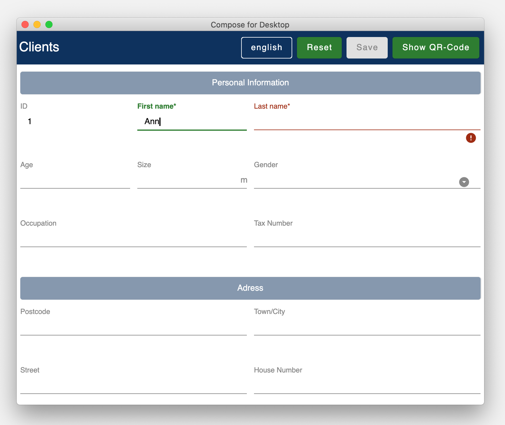

Der Code zu diesem Beispiel ist hier zu finden:

_[silver]#demo > src > main > kotlin > demo > personForm#_

Eine zusätzliche Benutzer-unterstützende Feature ist die Möglichkeit, das Smartphone für die Eingabe der einzelnen Input-Felder verwenden zu können. Über einen Boolean kann entschieden werden, ob die Smartphone-Eingabe-Möglichkeit für das Formular freigegeben werden soll. Dem End-User ist es frei überlassen, ob er das Smartphone verwenden möchte oder nicht. Über einen Button im Formular kann das Smartphone via QR-Code mit dem Desktop-Formular verbunden werden. Auf dem Smartphone werden dann individuelle Eingabe-Masken zum auf dem Desktop-fokussierten Inputfeld angezeigt.

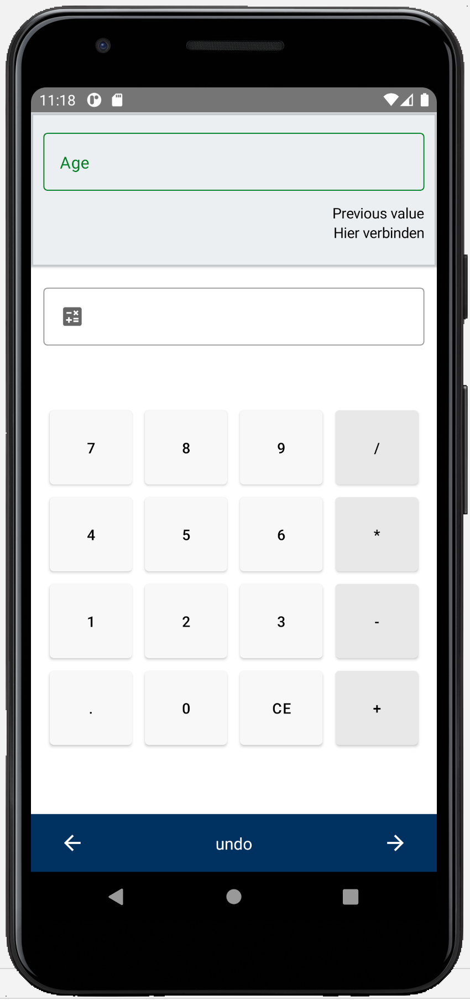

*Hinweis:*
Die Library befindet sich gerade im Entwicklungszustand und wird laufend verbessert, daher sind noch nicht alle Funktionalitäten verfügbar.

== Übersicht
Für die Erstellung eines Formulares sind grundsätzlich folgende 3 Klassen nötig:

* Model, in welchem Attribute und Gruppen definiert werden
* Enum, in welchem die Label-Namen definiert werden
* Starter-Klasse

== [[anchor-Model]] Model

Um ein Formular zu erstellen, muss zuerst ein Model erstellt werden. Dieses sollte das _BaseModel_ implementieren. +

[source,kotlin]
class PersonModel : BaseModel(iLabel = PersonLabels.SIZE, smartphoneOption = true) { ... }

( _[silver]#demo > src > main > kotlin > demo > personForm > PersonModel#_ )

Das BaseModel hat 2 Parameter: _iLabel_ und _smartPhoneOption_. +
Auf den Parameter _iLabel_ kommen wir später wieder zurück bei der Erstellung der Attribut-Label. +
Im Folgenden die Übersicht zu den beiden Parametern und ihrer Auswirkung:

.Attribut-Parameter
[cols="1,1,2",width=100%,frame=topbot]
|===
| Property | Typ |Beschreibung

|_iLabel_ *
|ILabel
|Hier sollte ein beliebiger Eintrag des zu erstellenden Label-Enums übergeben werden. Mehr Infos unter dem Attribut-Parameter  <<anchor-label, label>>. +
(Die Angabe des Parameters _iLabel_ ist notwendig, damit das Formular automatisch die verwendeten Sprachen erkennen kann).

| _smartphoneOption_
| Boolean
| Hier kann _true_ übergeben werden, wenn die Smartphoneverwendung zugelassen werden soll. (Dem User wird dann der QR-Code-Button angezeigt, um sich mit dem Handy verbinden zu können). +
_Wenn nichts übergeben wird, wird die Smartphone-Option default-mässig auf false gesetzt._

|===

_Parameter mit * sind zwingend erforrderlich. Parameter ohne * sind optional._

Im Model-Body kann nun in einem init-Block, welcher beim starten 1x ausgeführt wird, der Applikationstitel festgelegt werden:

[source,kotlin]
init {
        setTitle("Clients")
}

( _[silver]#demo > src > main > kotlin > demo > personForm > PersonModel#_ )

_Momentan ist für den Formular-Titel noch keine Mehrsprachigkeit-Möglichkeit verfügbar. Dies wird sich jedoch in Zukunft ändern._

Jetzt können hier im Model alle benötigten Attribute definiert werden.

== Attribute

=== Übersicht
Ein Attribut ist eine Wiederspiegelung eines Objektes eines bestimmten Typs
mit allen Werten und Informationen, die zur Interaktion (z.B. zum Speichern etc.) benötigt werden.

In dieser API gibt es folgende Attribut-Typen:

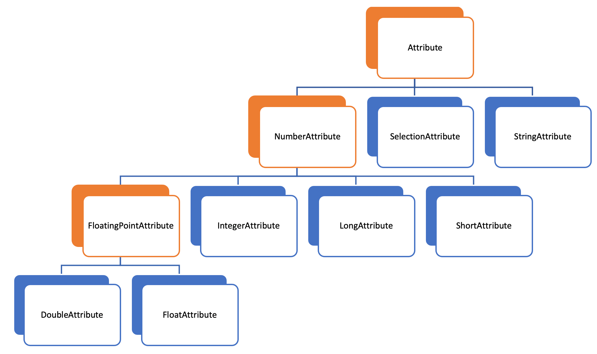

[red]#Orange:# Abstrakte Klassen  +
[blue]#Blau:# Konkrete Implementierungen. Diese können verwendet werden.

=== So wird ein Attribut erstellt:

Ein Beispiel: +
Es wird ein StringAttribut erstellt, in welchem der Strassenname gespeichert werden soll.

[source,kotlin]
val street = StringAttribute(model = this, label = PersonLabels.STREET)

( _[silver]#demo > src > main > kotlin > demo > personForm > PersonModel#_ )

Ein Attribut hat verschiedene Parameter, welche der Konfiguration des Attributs dienen. Bestimmte Parameter müssen angegeben werden (im Folgenden mit * markiert), andere sind optional und haben bereits einen Default-Wert gesetzt.

.Attribut-Parameter
[cols="1,1,2",width=100%,frame=topbot]
|===
| Property | Typ |Beschreibung

|<<anchor-model, model *>>
|IModel
|Model, welches alle Attribute verwaltet

| <<anchor-label, label *>>
| L
| Label-Text

| <<anchor-value, value>>
| T?
| letzter valider Wert

| <<anchor-required, required>>
| Boolean
| Ist das Attribut ein Pflichtfeld?

| <<anchor-readOnly, readOnly>>
| Boolean
| Ist das Attribut ein schreibgeschütztes Feld, das nicht verändert werden kann?

| <<anchor-onChangeListeners, onChangeListeners>>
| List<(T?) -> Unit>
| Listener, die auf Wert-Änderungen reagieren

| <<anchor-validators, validators>>
| List<SemanticValidator<T>>,
| Validatoren, die die festlegen wann der user input valid, invalid & onRightTrack ist

| <<anchor-convertibles, convertibles>>
| List<CustomConvertible>
| Convertibles, die dem User eine einfachere Eingabe erlauben

| <<anchor-meaning, meaning>>
| SemanticMeaning<T>
| Dem value eine semantische Bedeutung geben (beispielsweise, dass es eine Währung ist)

|===

Bestimmte Attribute besitzen weitere Parameter:

.Weitere Attribut-Parameter
[cols="1,1,1,1",width=100%,frame=topbot]
|===
| Attribut(e) | Property | Typ |Beschreibung

| FloatingPointAttribute
| <<anchor-decimalPlaces, decimalPlaces>>
| Int
| Legt die Anzahl zugelassener Nachkommastellen fest.

| SelectionAttribute
| <<anchor-possibleSelections, possibleSelections *>>
| Set<String>
| Legt das Set an Auswahlmöglichkeiten fest.

|===

== Gruppen

Nachdem alle Attribute erstellt wurden, können diese nun Gruppen zugeordnet werden. Nur Attribute, welche mindestens einer Gruppe zugewiesen sind werden im Formular angezeigt.

Wichtig hierbei ist, dass alle Attribute die der Gruppe zugewiesen werden, dasselbe Model haben wie die Gruppe.

Beispiel: Erstellung einer Gruppe im Model:

[source, kotlin]
val group2 = Group(model = this, title = "Adress",
        Field(postCode),
        Field(place),
        Field(street),
        Field(houseNumber)
    )

( _[silver]#demo > src > main > kotlin > demo > personForm > PersonModel#_ )

Eine Gruppe besitzt folgende Parameter:

.Group-Parameter
[cols="1,1,2",width=100%,frame=topbot]
|===
| Property | Typ |Beschreibung

|<<anchor-group-model, model *>>
|IModel
|Model, welches alle Attribute und Gruppen verwaltet.

| <<anchor-group-title, title *>>
| String
| Gruppen-Titel

| <<anchor-fields, field>>
| vararg
| Alle Felder die angezeigt werden sollen.

|===

Die Attribute können hier bewusst in gewünschter Reihenfolge in den Gruppen platziert werden. Auch die Grösse der Felder kann bestimmt werden (SMALL oder NORMAL).

== Starterklasse erstellen

Das Model ist nun fertig. Nun fehlt nur noch die Starterklasse, in welcher das UI mit dem model verbunden wird, um die Applikation zu starten.

Es wird eine neue Kotlin-Klasse erstellt, in folgendem Beispiel _Main.kt_.

[source, kotlin]
@ExperimentalFoundationApi
fun main() = Window() {
        val model = remember { PersonModel() }
        Form().of(model)
}

( _[silver]#demo > src > main > main.kt#_ )

Wichtig sind die Annotation _@ExperimentalFoundationApi_ und das _remember_ beim Initialisieren des Models.

Beim Window bieten sich folgende Parameter an, um das Window optimal anzuzeigen:

.Hilfreiche Window-Parameter (von Compose for Desktop)
[cols="1,1,2",width=100%,frame=topbot]
|===
| Property | Typ |Beschreibung

| title
| String
| Titel des Fensters definieren

| size
| IntSize
| Die Grösse des Fensters beim Aufstarten definieren.

|===

== Applikation starten

=== Desktop-Applikation starten

Die Starterklasse über die Entwicklngsumgebung starten.

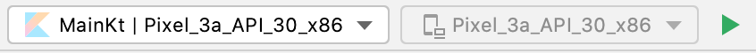

=== Smartphone-App auf einem Device installieren

Bevor die Smartphone-App sich via QR-Code mit dem Dektop verbinden kann, muss die App auf dem Android-Device (oder dem Emulator) installiert werden.
Hierzu einfach die ComposeForms.app in der Entwicklungsumgebung starten.

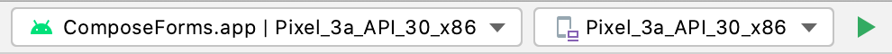

=== Smartphone-Applikation über QR-Code starten
Wenn sich das Smartphone via QR-Code (über die Desktop-Applikation) verbinden soll, muss die App bereits auf dem Smartphone installiert sein und das Smartphone sich im selben WLAN befinden, wie die Desktop-Applikation.

*Hinweis:* Um das Smartphone verwenden zu können muss beim <<anchor-Model, Model>> der Parameter _smartphoneOption_ auf true gesetzt sein.

=== Smartphone-Applikation über die Entwicklungsumgebung starten

Um die Smartphone-App über die Entwicklungsumgebung mit der Desktop-Applikation richtig verbinden zu können, muss im Model ( _[silver]#app > src > main > kotlin > ch > model > Model#_ ) in der Variable _mqttBroker_ die IP-Adresse des Desktop-Devices gesetzt werden.

[source, kotlin]
var mqttBroker    = "192.168.0.94" //Beispiel

_IP-Adresse herausfinden:_ +
Terminal öffnen und _ifconfig_ eingeben. +
Im Output ist unter _en0:_ unter anderem die IP-Adresse zu finden (hinter dem Wort _inet_)

Danach kann die Smartphone-App in der Entwicklungsumgebung gestartet werden:

*Hinweis:* Es wichtig, dass zuerst die Desktop-Appliaktion gestartet wird und erst danach das Smartphone, da sonst keine Verbindung zwischen den beiden Applikationen hergestellt werden kann.

== UI modifizieren (optional)

=== Farben ändern

Die Formular-Farben können im File _FormColors.kt_ ganz einfach modifiziert werden, in dem die Farbwerte in den Enums angepasst werden.

Das File befindet sich hier:

_[silver]#common > src > main > kotlin > ui > theme > FormColors.kt#_

== User-Experience

=== Zur Verfügung stehende Aktionen

image::img/header-functions.png[width =  600]

.User-Aktionen
[cols="3,1,3",width=100%,frame=topbot]
|===
| Funktionalität | aufgerufene Model-Funktion | Auswirkung

a|
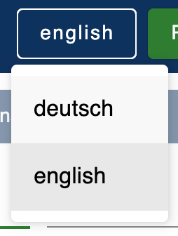
| setCurrentLanguageForAll( lang : String)
| Setzt die aktuelle Sprache. Die Sprachen müssen zuvor im Label-Enum definiert werden. (siehe <<anchor-label, label>>) +
_Diese Funktionalität ist noch nicht vollständig implementiert._

a|image::img/reset.png[width = 90]
| resetAll()
| Setzt die Werte aller Attribute auf die zuletzt gespeicherten Werte zurück.

a|image::img/save.png[width = 84]
| saveAll()
| Speichert die Werte (User-Inputs) aller Attribute, sofern alle in einem validen Zustand sind.

a|

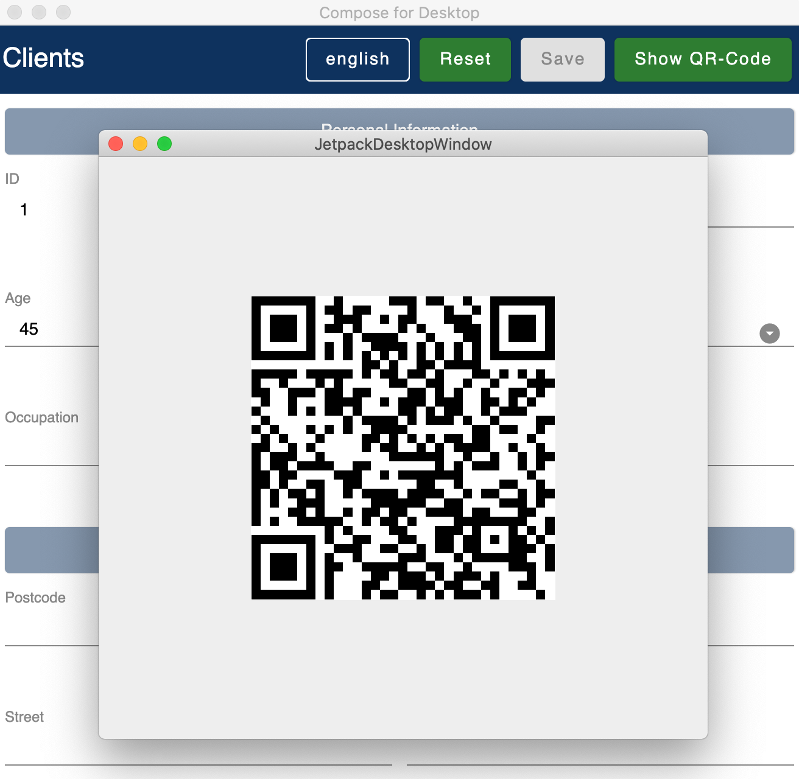
|
| Generiert einen QR-Code, sodass sich der User mit dem Smartphone verbinden kann.

|===

=== [[anchor-stati]] 3 Stati

Für eine bessere User-Experience können sich die Attribute in 3 verschiedenen Stati befinden. +
Mit dem _rightTrack_-Status sind die Zeiten vorbei, in denen sich der User über rote Fehlermeldungen aufregt, die von Anfang an angezeit werden, bevor der User auch nur die Chance hatte sich um einen richtigen Input zu bemühen. Der rightTrack-Status gibt an, ob sich der User auf dem richtigen Weg zu einem validen Input befindet. Erst, wenn der Input wirklich in die falsche Richtung geht wird der Input als invalid angezeigt.

.Übersicht zu den 3 Stati
[cols="2,1,3",width=100%,frame=topbot]
|===
| Aussehen | Status | Beschreibung

a|image::img/valid.png[width = 200]
| *valid* +

_(gültig)_
| Der Input ist in einem validen Zustand und kann somit gespeichert werden.
Valid  bedeutet der eingegebene Input (String): +
- kann in den Typ des Attributs umgewandelt werden +
- ist bezüglich des Parameter <<anchor-required, required>> in einem gültigen Zustand +
- ist bezüglich aller gesetzten Validatoren in einem gültigen Zustand +

a|image::img/invalid.png[width = 200]
| *invalid* +

_(nicht gültig)_
| Der Input befindet sich in einem invaliden Zustand und kann nicht abgespeichert werden.
Wenn der Input (String) nicht valid ist ist er in einem invaliden Zustand.

a|image::img/rigthtTrack.png[width = 200]
| *rightTrack* +

_(auf dem richtigen Weg zu einem validen Zustand)_
| Der rightTrack-Zustand besteht zusätzlich zu den beiden obigen. (Wenn der rightTrack-Zustand gesetzt ist, ist der Input also gleichzeitig in einem rightTrack-Zustand und einem invaliden oder validen Zustand. Wenn er nicht gesetzt ist, ist der Input invalid)

Der Input wird dem User als rightTrack-Zustand angezeigt, wenn sich der Input in einem Zustand befindet, der sich auf dem richtigen Weg zu einem validen Zustand befindet. Sobald der Zustand valid ist wird das Attribut als valid angezeigt. +
Der rightTrack Zustand wird nur angezeigt, wenn das Attribut noch nicht fokussiert wurde oder gerade fokussiert ist, danach wechselt es wieder in einen invaliden Zustand.

|===

==== Beispiel
Die obigen Inputfelder gehören zu folgendem Beispiel:

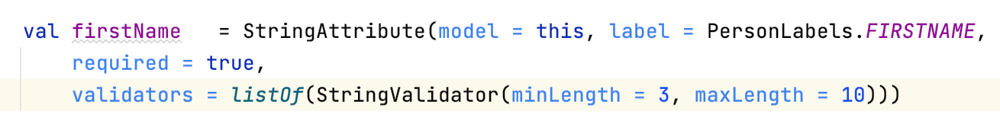

Der Input muss zwischen 3 und 10 Zeichen enthalten, um valid zu sein.

.Verhalten der Input-Felder
[cols="1,2,2",width=100%,frame=topbot]
|===
|Anz. Characters +
(Input-Länge)| Aussehen fokussiertes Feld| Aussehen nicht fokussiertes Feld +
(nachdem es bereits fokussiert wurde)

|0 - 2
a|image::img/rigthtTrack.png[width = 200]

rightTrack
a|image::img/rightTrack-unfocused.png[width = 200]
invalid

| 3 - 10
a|image::img/valid.png[width = 200]
valid
a|
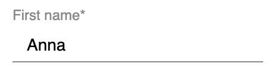
valid

| 10 - ...
a|image::img/invalid.png[width = 200]
invalid
a|
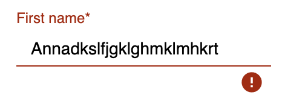
invalid
|===

== Tiefergehende Information / Hilfestellung

=== Komplikationen beim Starten

Was tun, wenn sich die Applikation nicht starten lässt?

==== Class not Found -> Fehlende VM options

Checke, ob in den Configurations die Variable _-cp $Classpath$_ bei der Starterklasse unter VM options gesetzt ist. Falls nicht sollte diese noch gesetzt werden.

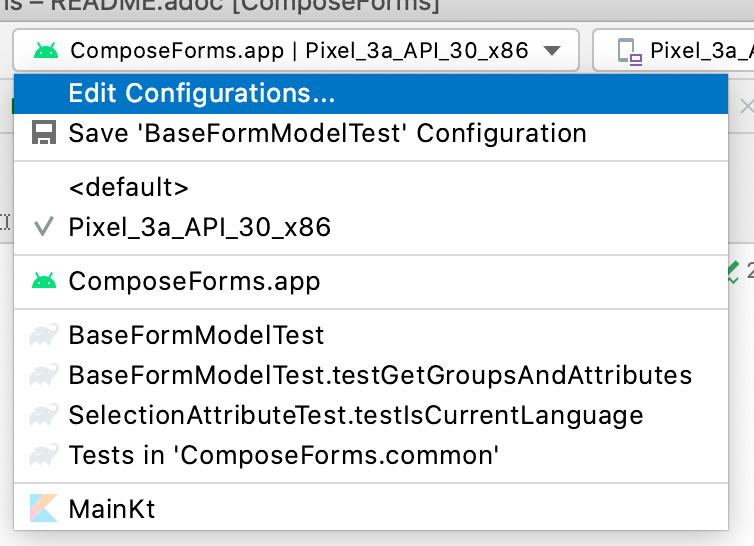

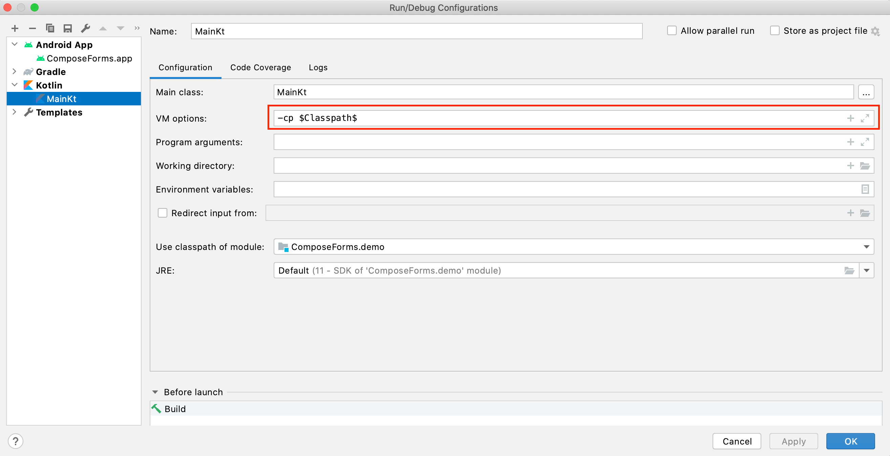

==== Language Not Found

Wenn diese Exception beim Starten erscheint wurde der Parameter _iLabel_ (siehe im Abschnitt <<anchor-Model, Model>>) nicht angegeben.

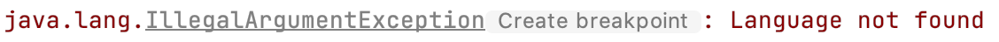

=== Attribut-Parameter

Im Folgenden eine detaillierte Erklärung zur richtigen Erstellung der Attribut-Parameter

==== [[anchor-model]] model _(erforderlich)_

Das Model der Gruppe, in welcher sich das Attribut befindet, muss dasselbe sein, wie das Model des Attributs. (Falls dies nicht der Fall ist wird eine Exception geworfen.)

*Beispiel 1 - Alles in einem Model* +
Die Attribute und Gruppen werden im selben Model erstellt.
Sowohl beim Attribut als auch bei der Gruppe wird _this_ als Model übergeben. +

( siehe: _[silver]#demo > src > main > kotlin > demo > personForm > PersonModel#_ )

*Beispiel 2 - Attribute und Gruppen in mehreren Klassen verteilt* +
Zusätzlich zu den Attributen aus Beispiel 1, soll ein weiteres Attribut auf dem Formular erscheinen. Dieses wird in diesem Beispiel direkt in der Starterklasse definiert und einer eigenen Gruppe übergeben. Damit es auf demselben Formular erscheint muss dasselbe Model als Parameter übergeben werden.

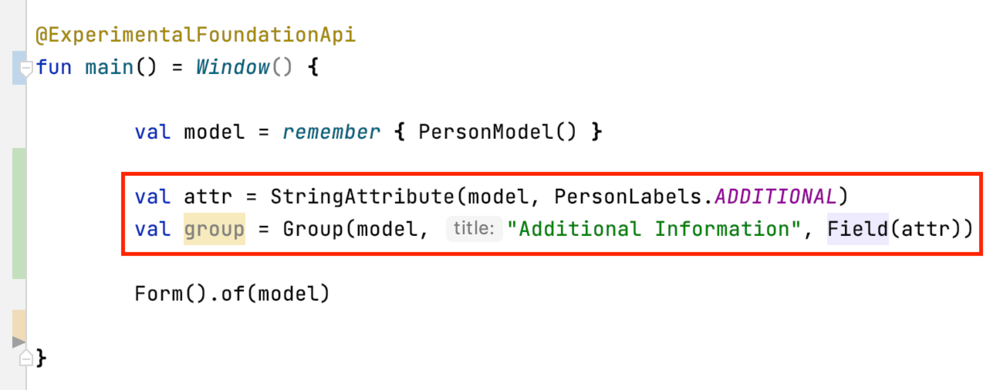

Nun erscheint in dem Formular die zusätzliche Gruppe mit dem Attribut unter den bereits im PersonModel definierten:

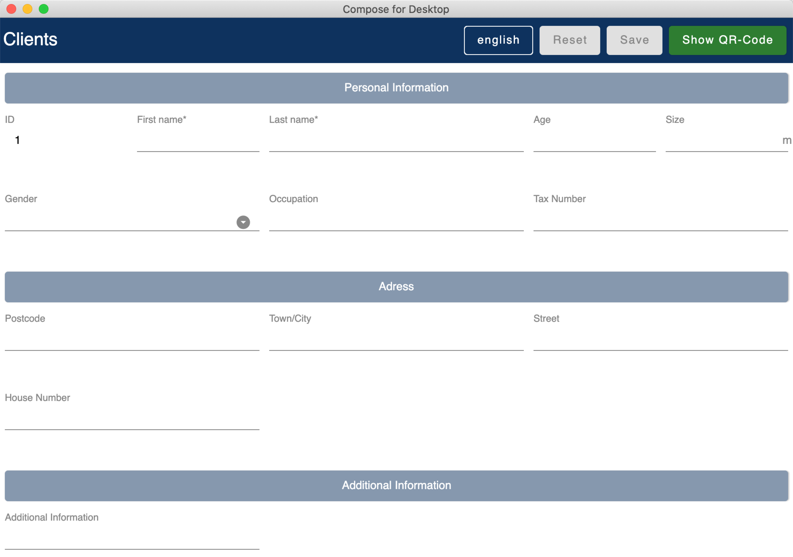

==== [[anchor-label]] label _(erforderlich)_

Um Mehrsprachigkeit zu gewährleisten müssen die Labeltexte in einem Enum angegeben werden.
Das Enum muss das Interface _ILabel_ implementieren und alle gewünschten Sprachen als Parameter mit Typ String definieren. +
Im Enum können nun Code-Variablen festgelegt werden, in welchen die Übersetzungen der Labeltexte definiert werden.

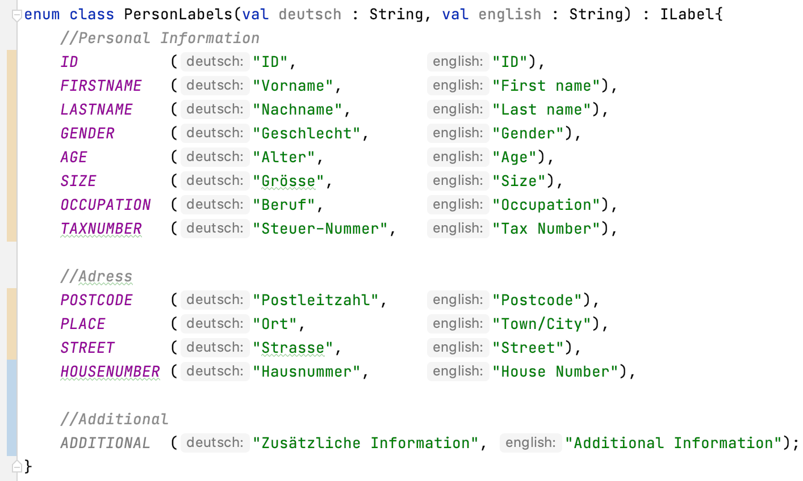
( _[silver]#demo > src > main > kotlin > demo > personForm > PersonLabels#_ )

Bei den Attributen muss dann nur noch die richtige Code-Variable als Label angegeben werden.

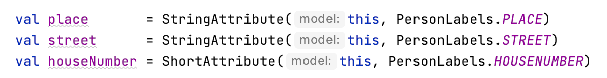
( _[silver]#demo > src > main > kotlin > demo > personForm > PersonModel#_ )

Damit die Sprachen vom Formular automatisch erkannt werden können, muss dem Model der Parameter _iLabel_ mitgegeben werden. Hier kann ein beliebiges Label aus der erstellten Label-Enum-Klasse angegeben werden.

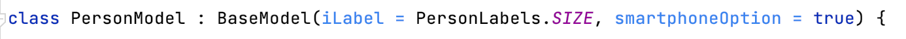

==== [[anchor-value]] value _(optional)_
Wenn ein Attribut beim ersten Öffnen des Formulars nicht leer sein soll, kann über den Parameter _value_ der Wert gesetzt werden. +

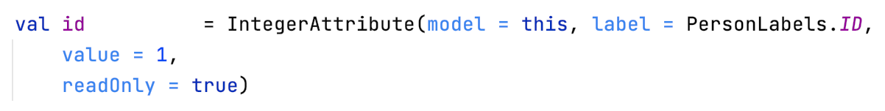
( _[silver]#demo > src > main > kotlin > demo > personForm > PersonModel#_ )

Der Wert muss vom gleichen Typ sein wie das Attribut! Bei keiner Angabe wird der Default-Wert _null_ gesetzt.

==== [[anchor-required]] required _(optional)_

Wenn ein Atribut ein Pflichtfeld sein soll (also der User also gezwungen werden soll eine Eingabe zu tätigen und das Feld nicht leer zu lassen), kann beim Parameter required _true_ übergeben werden.

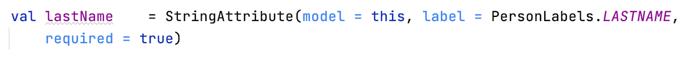
( _[silver]#demo > src > main > kotlin > demo > personForm > PersonModel#_ )

Bei keiner Angabe wird der Default-Wert _false_ gesetzt.

==== [[anchor-readOnly]] readOnly _(optional)_

Wenn ein Attribut für den User nur lesbar aber nicht modifizierbar sein soll, kann beim Parameter readonly _true_ übergeben werden.

( _[silver]#demo > src > main > kotlin > demo > personForm > PersonModel#_ )

Bei keiner Angabe wird der Default-Wert _false_ gesetzt.

==== [[anchor-onChangeListeners]] onChangeListeners _(optional)_

Mit onChangeListenern kann man bei Wertänderungen anderer Attribute das Attribut, auf dem die ChangeListener als Parameter übergeben sind, ändern.
Da mehrere onChangeListener übergeben werden können, muss immer eine Liste übergeben werden. In dieser können dann die onChangeListener gesetzt werden.

*Einen onChangeListener definieren:*

[fuchsia]#Attribut, dessen Wert observiert werden soll# *addOnChangeListener {* +
[lime]#Lambda-Parameter für dieses Attribut# *,* [purple]#Lambda-Parameter für zu observierenden Wert# *->* _Was wann passieren soll_ *}*

*Beispiel:*

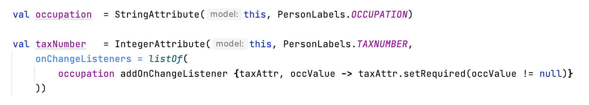
( _[silver]#demo > src > main > kotlin > demo > personForm > PersonModel#_ )

Sobald beim Attribut Beruf (occupation) etwas eingegeben wurde (Wert != null), soll die Steuernummer (taxnumber) zu einem Pflichtfeld werden.

Bei keiner Angabe wird der Default-Wert _emptyList()_ gesetzt.

==== [[anchor-validators]] validators _(optional)_

Man kann dem Attribut sogenannte _semantische Validatoren_ übergeben, mit welchen man die Validität des Attribut-Wertes einschränken kann.

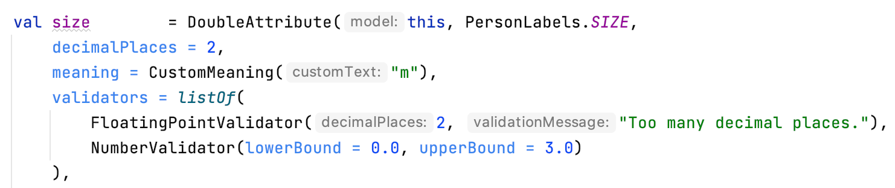

( _[silver]#demo > src > main > kotlin > demo > personForm > PersonModel#_ )

Da man mehrere Validatoren angeben kann, müssen diese immer in einer Liste übergeben werden ( _listOf(...)_ ). +

===== Validator-Veränderungen zur Laufzeit
Wenn man einen Validator zur Laufzeit noch verändern möchte, muss man diesen ausserhalb des Attributs als Variable definieren und dann übergeben:

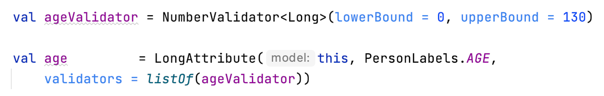

( _[silver]#demo > src > main > kotlin > demo > personForm > PersonModel#_ )

Mittels _override...Validator()_ (für ... den verwendeten Typ einsetzen) kann der Validator zur Laufzeit verändert werden.

Ein Beispiel:

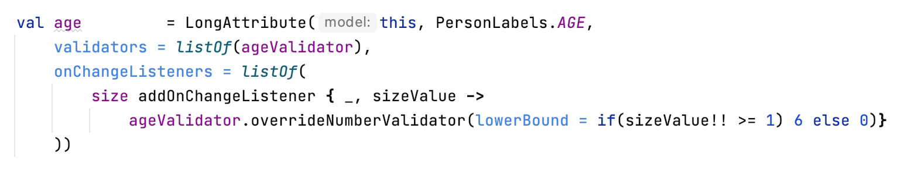

( _[silver]#demo > src > main > kotlin > demo > personForm > PersonModel#_ )

Wenn die Person >= 1m ist, dann muss diese mind. 6 Jahre alt sein. Wenn nicht kann sie auch jünger sein.
(Das _size_-Attribut wurde zuvor definiert)

===== Validatoren-Übersicht

Für bestimmte Attributtypen stehen bestimmte Validatoren mit unterschiedlichen Parametern zur Verfügung. Im Folgenden eine Übersicht über alle semantischen Validatoren und deren Parameter:

====== Number-Validator (für alle Number-Attribute)

.Number-Validator-Properties
[cols="1,1,2",width=100%,frame=topbot]
|===
| Property | Typ |Beschreibung

| lowerBound
| T?
| untere Grenze für Input

| upperBound
| T?
| obere Grenze für Input

| stepSize
| T?
| Schrittgrösse

| stepStart
| T?
| Zahl, von der aus die Schritte nach oben/unten gerechnet werden

| onlyStepValuesAreValid
| Boolean
| Wenn _true_ sind alle Zahlen zwischen den Schritten invalid. +
(Default-Wert: _false_)

| validationMessage
| String
| Nachricht, die dem User angezeigt werden soll, wenn der Input aufgrund dieses Validators invalid ist.
|===

====== FloatingPoint-Validator (für alle FloatingPoint-Attribute)

.FloatingPoint-Validator-Properties
[cols="1,1,2",width=100%,frame=topbot]
|===
| Property | Typ |Beschreibung

| decimalPlaces
| Int
| Anzahl erlaubter Nachkommastellen +
(Default-Wert: _10_)

| validationMessage
| String
| Nachricht, die dem User angezeigt werden soll, wenn der Input aufgrund dieses Validators invalid ist.
|===

====== Selection-Validator (für alle Selection-Attribute)

.Selection-Validator-Properties
[cols="1,1,2",width=100%,frame=topbot]
|===
| Property | Typ |Beschreibung

| minNumberOfSelections
| Int
| minimale Anzahl Selektionen, die vom User ausgewählt werden müssen. +
(Default-Wert: _0_)

| maxNumberOfSelections
| Int
| maximale Anzahl Selektionen, die vom User ausgewählt werden müssen. +
(Default-Wert: _Int.MAX_VALUE_)

| validationMessage
| String
| Nachricht, die dem User angezeigt werden soll, wenn der Input aufgrund dieses Validators invalid ist.
|===

====== String-Validator (für alle String-Attribute)

.String-Validator-Properties
[cols="1,1,2",width=100%,frame=topbot]
|===
| Property | Typ |Beschreibung

| minLength
| Int
| minimale Länge des Inputwortes. (Anzahl Characters) +
(Default-Wert: _0_)

| maxLength
| Int
| maximale Länge des Inputwortes. (Anzahl Characters) +
(Default-Wert: _1_000_000_)

| validationMessage
| String
| Nachricht, die dem User angezeigt werden soll, wenn der Input aufgrund dieses Validators invalid ist.
|===

====== Regex-Validator (für alle Attribute)

.Regex-Validator-Properties
[cols="1,1,2",width=100%,frame=topbot]
|===
| Property | Typ |Beschreibung

| regexPattern
| String
| Regex, der angibt wann das Inputwort valid ist, als String.

| rightTrackRegexPattern
| String
| Regex, der angibt wann das Inputwort <<anchor-stati, onRightTrack>> ist, als String.

| validationMessage
| String
| Nachricht, die dem User angezeigt werden soll, wenn der Input aufgrund dieses Validators invalid ist.
|===

Beispiel:

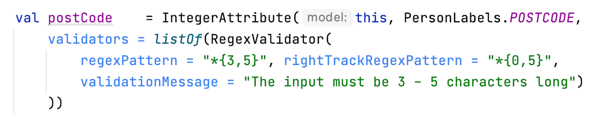
( _[silver]#demo > src > main > kotlin > demo > personForm > PersonModel#_ )

====== Custom-Validator (für alle Attribute)

.Custom-Validator-Properties
[cols="1,1,2",width=100%,frame=topbot]
|===
| Property | Typ |Beschreibung

| validationFunction
| (T?) -> Boolean
| Regex, der angibt wann das Inputwort valid ist, als String.

| rightTrackFunction
| ((T?) -> Boolean) ?
| Regex, der angibt wann das Inputwort <<anchor-stati, onRightTrack>> ist, als String.

| validationMessage
| String
| Nachricht, die dem User angezeigt werden soll, wenn der Input aufgrund dieses Validators invalid ist.
|===

Beispiel: +

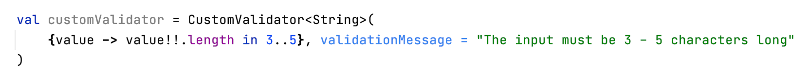

==== [[anchor-convertibles]] convertibles  _(optional)_
==== [[anchor-meaning]] meaning  _(optional)_

Über den _meaning_-Parameter kann man dem Attribut-Wert eine Bedeutung geben.
Zum Beispiel, dass der Wert in Metern angegeben ist:

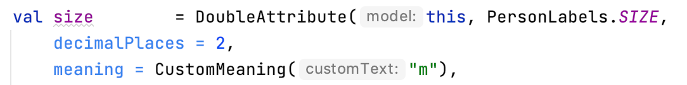

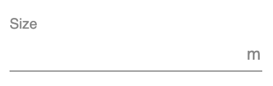

Es gibt verschiedene Meanings, welche man erstellen kann:

.Meanings
[cols="1,1,2",width=100%,frame=topbot]
|===
| Meaning | Beschreibung |Beispiel-Code

| *Currency(* _currency_ *)* +

_(nur für Number-Attribute)_
| Nimmt einen Währungs-Iso-Code und wandelt ihn in das entsprechende Währungszeichen um, welches dann auf dem Formular erscheint.
a|image::img/codeEur.png[]

| *Percentage( )* +

_(nur für Number-Attribute)_
| Auf dem Formular erscheint ein %-Zeichen.
a|image::img/percentageCode.png[width = 180]

| *CustomMeaning(* _customText_ *)*
| Nimmt einen String, welcher dann genau so auf dem Formular erscheint.
a|image::img/kgCode.png[width = 300]
|===

==== [[anchor-decimalPlaces]] decimalPlaces _(optional)_

*Nur für FloatingPoint-Attribute*

Bei Attributen die Kommazahlen als Wert speichern, kann zusätzlich angegeben werden wie viele Nachkommastellen maximal erwünscht sind.
Sobald der User mehr Kommastellen eingibt wird der Input invalid.

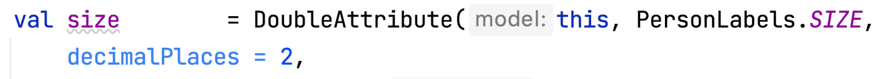
( _[silver]#demo > src > main > kotlin > demo > personForm > PersonModel#_ )

Bei keiner Angabe wird der Default-Wert _8_ gesetzt.

==== [[anchor-possibleSelections]] possibleSelections _(erforderlich)_
*Nur für Selection-Attribute*

Beim Selection-Attribut müssen die Auswahlmöglichkeiten, die dem User zur Verfügung stehen über den Parameter _possibleSelections_, angegeben werden. Die Auswahlmöglichkeiten müssen als Strings in einem Set übergeben werden.

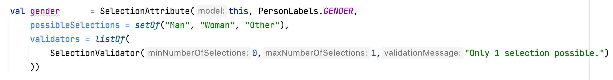

_Momentan ist hier noch keine Mehrsprachigkeit-Möglichkeit verfügbar. Dies wird sich in Zukunft ändern._

=== Group-Parameter

Im Folgenden eine detaillierte Erklärung zur richtigen Erstellung der Group-Parameter

==== [[anchor-group-model]] model _(erforderlich)_

Das Model der Gruppe muss dasselbe sein, wie das Model der Attribute, die sich in der Gruppe befinden (im Parameter <<anchor-fields, fields>>). Falls dies nicht der Fall ist wird eine Exception geworfen. +
*Beispiele*: siehe Parameter <<anchor-model, model>> beim Attribut.

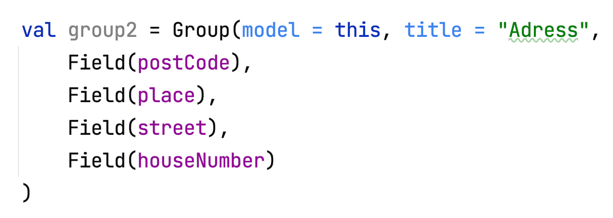
( _[silver]#demo > src > main > kotlin > demo > personForm > PersonModel#_ )

==== [[anchor-group-title]] title _(erforderlich)_

Es muss ein Gruppen-Titel als String angegeben werden.

( _[silver]#demo > src > main > kotlin > demo > personForm > PersonModel#_ )

_Momentan ist hier noch keine Mehrsprachigkeit-Möglichkeit verfügbar. Dies wird sich in Zukunft ändern._

==== [[anchor-fields]] fields _(optional)_

Über den _fields_-Parameter können die Attribute als Felder hinzugefügt werden.

Bei der _Group_ und _Field_ sollte darauf geachtet werden, dass die richtigen Klassen importiert werden:

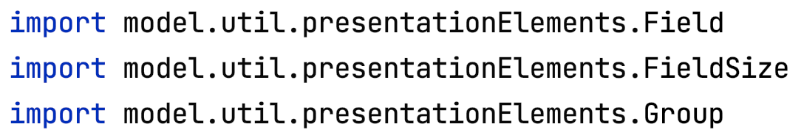

Die Felder können einfach durch Komma getrennt angegeben werden:

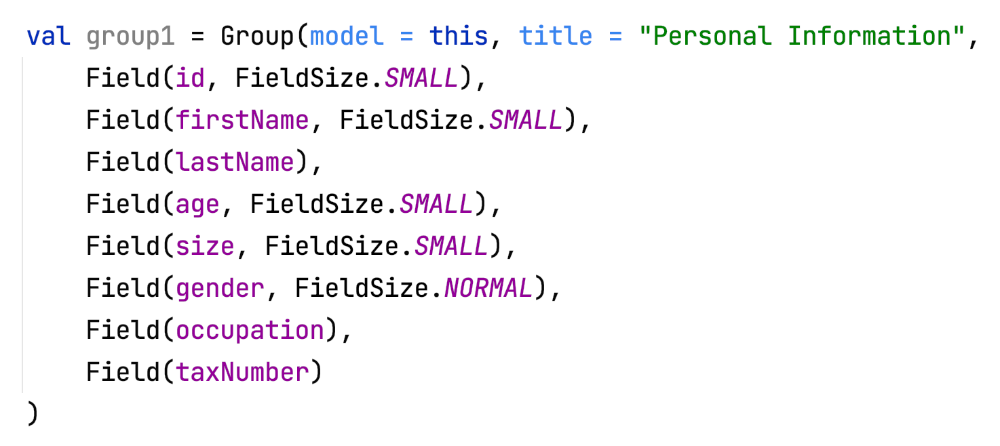

Ein Field hat die Parameter *attribute* _(erforderlich)_, bei dem ein Attribut übergeben werden kann und *fieldSize* _(optional)_, mit dem die Grösse des Inputfeldes bestimmt werden kann.

Wenn dem Field keine _fieldSize_ übergeben wird, wird der Default-Wert _FieldSize.NORMAL_ gesetzt.

Die Felder erscheinen in derselben Reihenfolge, wie sie der Gruppe übergeben werden. +
FieldSize.SMALL ist halb so gross wie FieldSize.NORMAL:

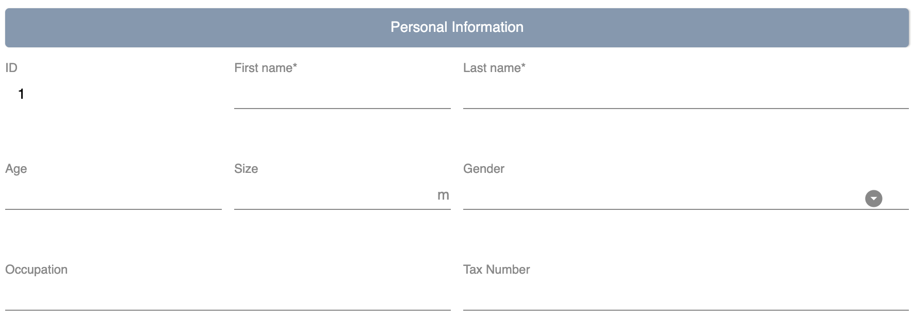

Wenn der Gruppe keine Felder übergeben werden wird im Formular nur der Gruppen-Titel angezeigt.

== Konfiguration zur Laufzeit

Diese Funktionen sind beispielsweise bei Verwendung von onChange-Listenern hilfreich.

=== Attribut-Funktionen

Die folgenden Funktionen können auf Attributen aufgerufen werden:

.Einige hilfreiche Setter-Funktionen eines Attributs
[cols="2,2",width=100%,frame=topbot]
|===
| Funktion |  Beschreibung

| setValAsText(valueAsText : String)
| Den User-Input setzen +

| setRequired(isRequired : Boolean)
| Siehe Attribut-Parameter <<anchor-required, required>>

| setReadOnly(isReadOnly : Boolean)
| Siehe Attribut-Parameter <<anchor-readOnly, readOnly>>

|===

.Einige hilfreiche Getter-Funktionen eines Attributs
[cols="2,1,2",width=100%,frame=topbot]
|===
| Funktion | Rückgabe-Typ | Beschreibung

| getId()
| Int
| Gibt die Id des Attributs zurück

| getValue()
| T?
| Gibt den letzten validen Wert zurück.

| getSavedValue()
| T?
| Gibt den gespeicherten Wert zurück.

| getRightTrackValue()
| T?
| Gibt den letzten right-Track-validen Wert zurück.

| getValueAsText()
| String
| Gibt den aktuellen User-Input-String zurück

| getPossibleSelections()
| Set<String>
| Beim Selection-Attribut wird das Set mit den gesetzten Auswahlmöglichkeiten zurückgegeben. Bei anderen Attributtypen bestehen die Auswahlmöglichkeiten des Sets aus früheren User-Input-Eingaben (noch nicht implementiert).

| getLabel()
| String
| Gibt den aktuellen Label-Text zurück

| isRequired()
| Boolean
| Gibt zurück, ob eine Eingabe erforderlich ist

| isReadOnly()
| Boolean
| Gibt zurück, ob der Wert verändert werden darf

| isChanged()
| Boolean
| Gibt zurück, ob value gleich ist wie savedValue

| isValid()
| Boolean
| Gibt zurück, ob der User-Input (valueAsText) valid ist

| isRightTrackValid()
| Boolean
| Gibt zurück, ob der User-Input auf dem richtigen Weg zu einem validen Input ist.

| getErrorMessages()
| List<String>
| Gibt alle auf den aktuellen Input (valueAsText) zutreffenden ErrorMessages zurück

|===

=== Model-Funktionen

Die folgenden Funktionen können auf einem Model aufgerufen werden:

.Einige hilfreiche Funktionen des Base-Models (Diese Funktionen beeinflussen alle Attribute)
[cols="2,2",width=100%,frame=topbot]
|===
| Funktion |  Beschreibung

| setValAsText(valueAsText : String)
| Den User-Input setzen +

| setRequired(isRequired : Boolean)
| Siehe Attribut-Parameter <<anchor-required, required>>

| setReadOnly(isReadOnly : Boolean)
| Siehe Attribut-Parameter <<anchor-readOnly, readOnly>>

|===

=== Validator-Funktionen

Die folgenden Funktionen können auf einem Validator aufgerufen werden:

.Funktion, um einen Validator zur Laufzeit verändern zu können
[cols="2,2",width=100%,frame=topbot]
|===
| Funktion |  Beschreibung

| override...Validator() +

(_für ... den richtigen Typ einsetzen_)
| Mit dieser Funktion kann der jeweilige Validator überschrieben werden.
Es stehen die gleichen Parameter zur Verfügung wie bei der Initialisierung des jeweiligen Validators. Siehe <<anchor-validators, validators>>.