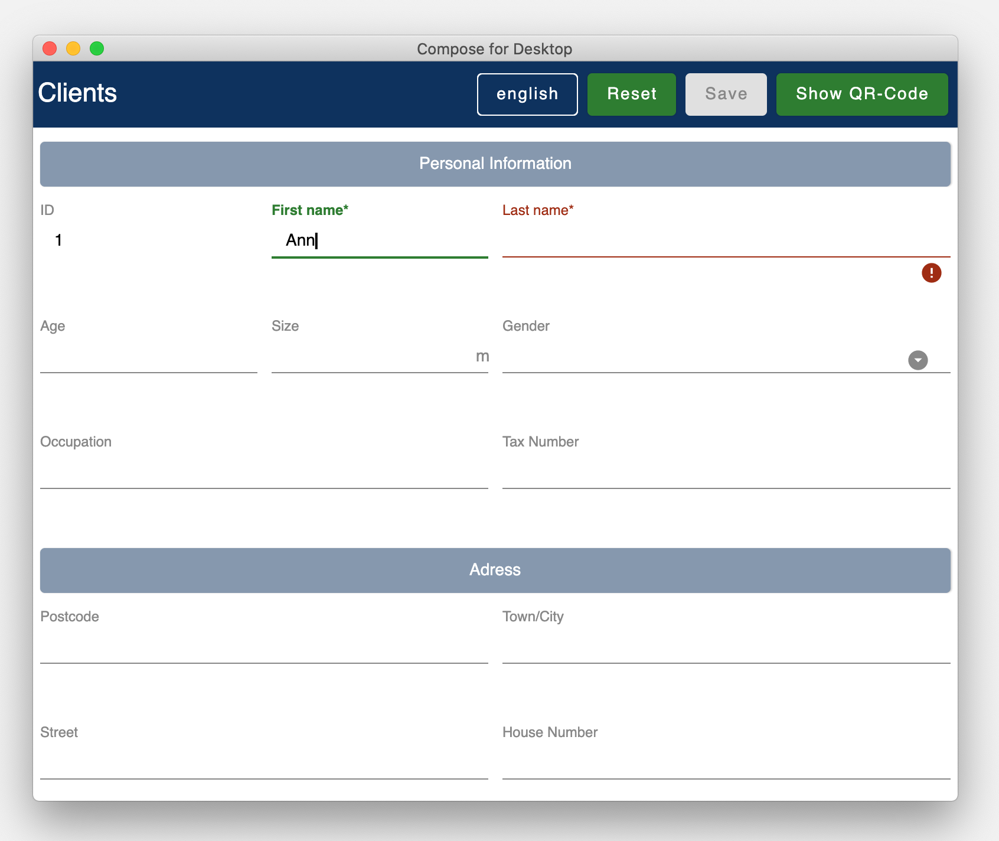
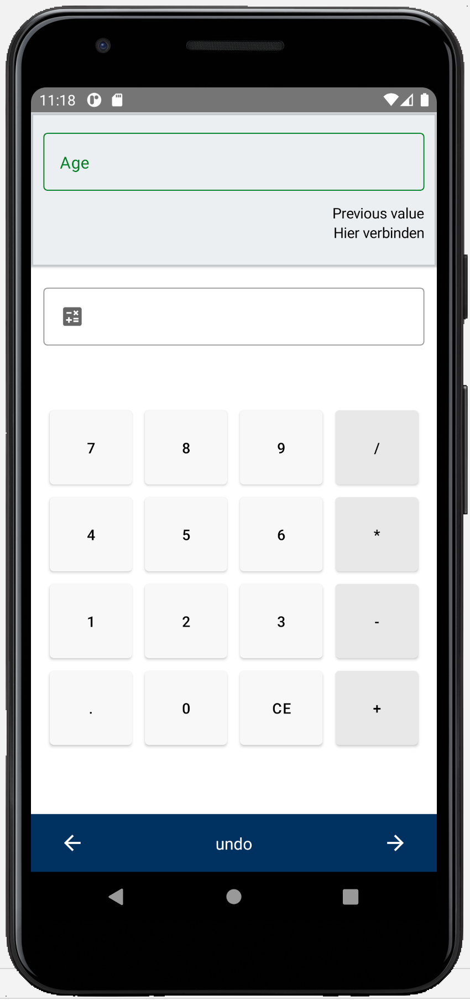
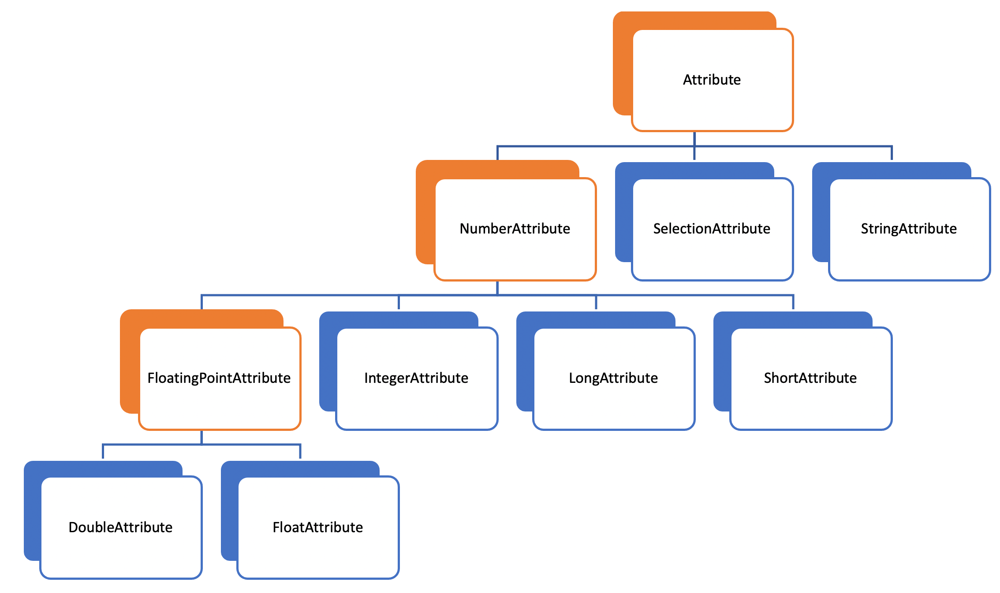
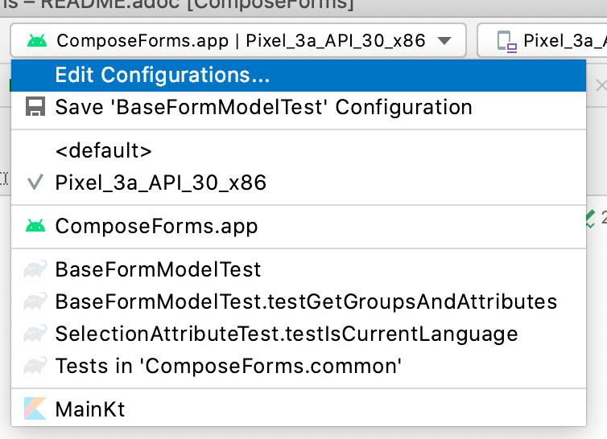
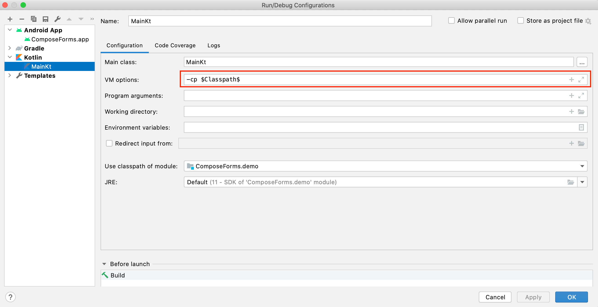

= ReadMe Compose Forms
:icons: font
:stem:
:toc: left
:url-docs: https://asciidoctor.org/docs
:url-gem: https://rubygems.org/gems/asciidoctor

Compose Forms ist eine Library, mit welcher sich schnell und einfach schöne & benutzerfreundliche Formulare erstellen lassen.

Der Code zu diesem Beispiel ist hier zu finden:

[red]#demo > src > main > kotlin > demo > personForm#

Eine zusätzliche Benutzer-unterstützende Feature ist die Möglichkeit, das Smartphone für die Eingabe der einzelnen Input-Felder verwenden zu können. Über einen Boolean kann entschieden werden, ob die Smartphone-Eingabe-Möglichkeit für das Formular freigegeben werden soll. Dem End-User ist es frei überlassen, ob er das Smartphone verwenden möchte oder nicht. Über einen Button im Formular kann das Smartphone via QR-Code mit dem Desktop-Formular verbunden werden. Auf dem Smartphone werden dann individuelle Eingabe-Masken zum auf dem Desktop-fokussierten Inputfeld angezeigt.

*Hinweis:*
Die Library befindet sich gerade im Entwicklungszustand und wird laufend verbessert, daher sind noch nicht alle Funktionalitäten verfügbar.

== Übersicht
Für die Erstellung eines Formulares sind grundsätzlich folgende 3 Klassen nötig:

* Model, in welchem Attribute und Gruppen definiert werden
* Enum, in welchem die Label-Namen definiert werden
* Starter-Klasse

== Model

Um ein Formular zu erstellen, muss zuerst ein Model erstellt werden. Dieses sollte das BaseModel implementieren. +

[source,kotlin]
class UserDefinedModel : BaseModel(){ }

Nun kann in einem init-Block, welcher beim starten 1x ausgeführt wird, der Applikationstitel festgelegt werden, die Sprache gesetzt werden und falls das Smartphone verwendet werden soll auch dieses startbar gemacht werden.

[source,kotlin]
init {
        setTitle("Demo Title")
        setCurrentLanguageForAll("english")
        startUp()
}

Jetzt können hier im Model alle benötigten Attribute definiert werden.

== Attribute

=== Übersicht
Ein Attribut ist eine Wiederspiegelung eines Objektes eines bestimmten Typs
mit allen Werten und Informationen, die zur Interaktion (z.B. zum Speichern etc.) benötigt werden.

In dieser API gibt es folgende Attribut-Typen:

[red]#Orange:# Abstrakte Klassen  +
[blue]#Blau:# Konkrete Implementierungen. Diese können verwendet werden.

=== So wird ein Attribut erstellt:

Ein Beispiel: +
Es wird ein StringAttribut erstellt, in welchem der Strassenname gespeichert werden soll.

[source,kotlin]
val street = StringAttribute(model = this, label = PersonLabels.STREET)

Ein Attribut hat verschiedene Parameter, welche der Konfiguration des Attributs dienen. Bestimmte Parameter müssen angegeben werden (im Folgenden mit * markiert), andere sind optional und haben bereits einen Default-Wert gesetzt.

.Attribut-Parameter
[cols="1,1,2",width=100%,frame=topbot]
|===
| Property | Typ |Beschreibung

|<<anchor-model, model *>>
|IModel
|Model, welches alle Attribute verwaltet

| <<anchor-label, label *>>
| L
| Label-Text

| <<anchor-value, value>>
| T?
| letzter valider Wert

| <<anchor-required, required>>
| Boolean
| Ist das Attribut ein Pflichtfeld?

| <<anchor-readOnly, readOnly>>
| Boolean
| Ist das Attribut ein schreibgeschütztes Feld, das nicht verändert werden kann?

| <<anchor-onChangeListeners, onChangeListeners>>
| List<(T?) -> Unit>
| Listener, die auf Wert-Änderungen reagieren

| <<anchor-validators, validators>>
| List<SemanticValidator<T>>,
| Validatoren, die die festlegen wann der user input valid, invalid & onRightTrack ist

| <<anchor-convertibles, convertibles>>
| List<CustomConvertible>
| Convertibles, die dem User eine einfachere Eingabe erlauben

| <<anchor-meaning, meaning>>
| SemanticMeaning<T>
| Dem value eine semantische Bedeutung geben (beispielsweise, dass es eine Währung ist)

|===

Bestimmte Attribute besitzen weitere Parameter:

.Weitere Attribut-Parameter
[cols="1,1,1,1",width=100%,frame=topbot]
|===
| Attribut(e) | Property | Typ |Beschreibung

| FloatingPointAttribute
| <<anchor-decimalPlaces, decimalPlaces>>
| Int
| Legt die Anzahl zugelassener Nachkommastellen fest.

| SelectionAttribute
| <<anchor-possibleSelections, possibleSelections *>>
| Set<String>
| Legt das Set an Auswahlmöglichkeiten fest.

|===

== Gruppen

Nachdem alle Attribute erstellt wurden, können diese nun Gruppen zugeordnet werden. Nur Attribute, welche mind. einer Gruppe zugewiesen sind werden im Formular angezeigt.

Beispiel: Erstellung einer Gruppe im Model:

[source, kotlin]
val group1 = Group(this, "Group-Name",
Field(s, FieldSize.SMALL),
Field(d1, FieldSize.SMALL),
Field(d2),
Field(selectionValue))

Eine Gruppe besitzt folgende Parameter:

.Group-Parameter
[cols="1,1,2",width=100%,frame=topbot]
|===
| Property | Typ |Beschreibung

|<<anchor-group-model, model *>>
|IModel
|Model, welches alle Attribute und Gruppen verwaltet.

| <<anchor-group-title, title *>>
| String
| Gruppen-Titel

| <<anchor-fields, field>>
| vararg
| Alle Felder die angezeigt werden sollen.

|===

Die Attribute können hier bewusst in gewünschter Reihenfolge in den Gruppen platziert werden. Auch die Grösse der Felder kann bestimmt werden (SMALL oder NORMAL).

== Starterklasse erstellen

Das Model ist nun fertig. Nun fehlt nur noch die Starterklasse, in welcher das UI mit dem model verbunden wird, um die Applikation zu starten.

Es wird eine neue Kotlin-Klasse erstellt, in folgendem Beispiel _Main.kt_.

[source, kotlin]
@ExperimentalFoundationApi
fun main() = Window() {
        val model = remember { UserDefinedModel() }
        Form().of(model)
}

Wichtig sind die Annotation _@ExperimentalFoundationApi_ und das _remember_ beim Initialisieren des Models

Beim Window bieten sich folgende Parameter an, um das Window optimal anzuzeigen:

.Hilfreiche Window-Parameter (von Compose for Desktop)
[cols="1,1,2",width=100%,frame=topbot]
|===
| Property | Typ |Beschreibung

| title
| String
| Titel des Fensters definieren

| size
| IntSize
| Die Grösse des Fensters beim Aufstarten definieren.

|===

== UI modifizieren (optional)

=== Farben ändern

Die Formular-Farben können im File _FormColors.kt_ ganz einfach modifiziert werden, in dem die Farbwerte in den Enums angepasst werden.

Das File befindet sich hier:

[red]#common > src > main > kotlin > ui > theme > FormColors.kt#

== User-Experience

=== Zur Verfügung stehende Aktionen

.User-Aktionen
[cols="3,1,3",width=100%,frame=topbot]
|===
| Funktionalität | aufgerufene Model-Funktion | Auswirkung

| BILD +
| saveAll()
| Speichert die Werte (User-Inputs) aller Attribute, sofern alle in einem validen Zustand sind.

| BILD +
| resetAll()
| Setzt die Werte aller Attribute auf die zuletzt gespeicherten Werte zurück.

| BILD +
| setCurrentLanguageForAll( lang : String)
| Setzt die aktuelle Sprache. Die Sprachen müssen zuvor im Label-Enum definiert werden. (siehe <<anchor-label, label>>) +
_Diese Funktionalität ist noch nicht vollständig implementiert._

| BILD +
|
| Generiert einen QR-Code, sodass sich der User mit dem Smartphone verbinden kann.

|===

=== 3 Stati

Für eine bessere User-Experience können sich die Attribute in 3 verschiedenen Stati befinden. +
Mit dem _rightTrack_-Status sind die Zeiten vorbei, in denen sich der User über rote Fehlermeldungen aufregt, die von Anfang an angezeit werden, bevor der User auch nur die Chance hatte sich um einen richtigen Input zu bemühen. Der rightTrack-Status gibt an, ob sich der User auf dem richtigen Weg zu einem validen Input befindet. Erst, wenn der Input wirklich in die falsche Richtung geht wird der Input als invalid angezeigt.

.Übersicht zu den 3 Stati
[cols="2,1,3",width=100%,frame=topbot]
|===
| Aussehen | Status | Auswirkung

| BILD +
| valid
|

| BILD +
| invalid
|

| BILD +
| rightTrack
|

|===

==== Beispiel

== Tiefergehende Information / Hilfestellung

=== Komplikationen beim Starten

Was tun, wenn sich die Applikation nicht starten lässt?

Checke, ob in den Configurations die Variable _-cp $Classpath$_ bei der Starterklasse unter VM options gesetzt ist.

Starte dann die Applikation erneut.

=== Attribut-Parameter

Im Folgenden eine detaillierte Erklärung zur richtigen Erstellung der Attribut-Parameter

==== [[anchor-model]] model
==== [[anchor-label]] label
==== [[anchor-value]] value
==== [[anchor-required]] required
==== [[anchor-readOnly]] readOnly
==== [[anchor-onChangeListeners]] onChangeListeners
==== [[anchor-validators]] validators

===== Number-Validator

.Number-Validator-Properties
[cols="1,1,2",width=100%,frame=topbot]
|===
| Property | Typ |Beschreibung

| lowerBound
| Int
| untere Grenze für Input

| upperBound
| Int
| obere Grenze für Input

| stepSize
| Int
| Schrittgrösse

| stepStart
| Int
| Zahl, von der aus die Schritte nach oben/unten gerechnet werden
|===

==== [[anchor-convertibles]] convertibles
==== [[anchor-meaning]] meaning
==== [[anchor-decimalPlaces]] decimalPlaces
==== [[anchor-possibleSelections]] possibleSelections

=== Group-Parameter

Im Folgenden eine detaillierte Erklärung zur richtigen Erstellung der Group-Parameter

==== [[anchor-group-model]] model
==== [[anchor-group-title]] title
==== [[anchor-fields]] fields

== Konfiguration zur Laufzeit

Diese Funktionen sind beispielsweise bei Verwendung von onChange-Listenern hilfreich.

=== Attribut-Funktionen

Die folgenden Funktionen können auf Attributen aufgerufen werden:

.Einige hilfreiche Setter-Funktionen eines Attributs
[cols="2,2",width=100%,frame=topbot]
|===
| Funktion |  Beschreibung

| setValAsText(valueAsText : String)
| Den User-Input setzen +

| setRequired(isRequired : Boolean)
| Siehe Attribut-Parameter <<anchor-required, required>>

| setReadOnly(isReadOnly : Boolean)
| Siehe Attribut-Parameter <<anchor-readOnly, readOnly>>

|===

.Einige hilfreiche Getter-Funktionen eines Attributs
[cols="2,1,2",width=100%,frame=topbot]
|===
| Funktion | Rückgabe-Typ | Beschreibung

| getId()
| Int
| Gibt die Id des Attributs zurück

| getValue()
| T?
| Gibt den letzten validen Wert zurück.

| getSavedValue()
| T?
| Gibt den gespeicherten Wert zurück.

| getRightTrackValue()
| T?
| Gibt den letzten right-Track-validen Wert zurück.

| getValueAsText()
| String
| Gibt den aktuellen User-Input-String zurück

| getPossibleSelections()
| Set<String>
| Beim Selection-Attribut wird das Set mit den gesetzten Auswahlmöglichkeiten zurückgegeben. Bei anderen Attributtypen bestehen die Auswahlmöglichkeiten des Sets aus früheren User-Input-Eingaben (noch nicht implementiert).

| getLabel()
| String
| Gibt den aktuellen Label-Text zurück

| isRequired()
| Boolean
| Gibt zurück, ob eine Eingabe erforderlich ist

| isReadOnly()
| Boolean
| Gibt zurück, ob der Wert verändert werden darf

| isChanged()
| Boolean
| Gibt zurück, ob value gleich ist wie savedValue

| isValid()
| Boolean
| Gibt zurück, ob der User-Input (valueAsText) valid ist

| isRightTrackValid()
| Boolean
| Gibt zurück, ob der User-Input auf dem richtigen Weg zu einem validen Input ist.

| getErrorMessages()
| List<String>
| Gibt alle auf den aktuellen Input (valueAsText) zutreffenden ErrorMessages zurück

|===

=== Model-Funktionen

Die folgenden Funktionen können auf einem Model aufgerufen werden:

.Einige hilfreiche Funktionen des Base-Models (Diese Funktionen beeinflussen alle Attribute)
[cols="2,2",width=100%,frame=topbot]
|===
| Funktion |  Beschreibung

| setValAsText(valueAsText : String)
| Den User-Input setzen +

| setRequired(isRequired : Boolean)
| Siehe Attribut-Parameter <<anchor-required, required>>

| setReadOnly(isReadOnly : Boolean)
| Siehe Attribut-Parameter <<anchor-readOnly, readOnly>>

|===