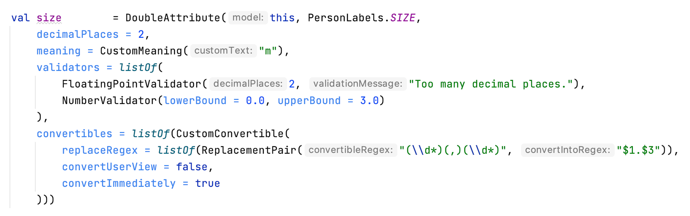

= ReadMe Compose Forms
:icons: font
:stem:
:toc: left
:url-docs: https://asciidoctor.org/docs
:url-gem: https://rubygems.org/gems/asciidoctor

German ReadMe: See document _[silver]#README_GERMAN.adoc#_

Compose Forms is a library that allows you to create beautiful & user-friendly forms quickly and easily.

image::img/desktop-form.png[width = 500]

The code for this example can be found here:

_[silver]#demo > src > main > kotlin > demo > personForm#_

An additional user-supporting feature is the possibility to use the smartphone for the input of the individual fields. A boolean can be used to decide whether the smartphone input option should be enabled for the form. The end user is free to decide whether to use the smartphone or not. A button in the form allows the smartphone to be connected to the desktop form via QR code. Individual input masks for the desktop-focused input field are then displayed on the smartphone.

*Used Technologies:*
Kotlin, Compose for Desktop, Jetpack Compose

*Note:* The library is currently under development and is being improved continuously, therefore not all functionalities are available yet.

== Installation

You need:

* [[anchor-intelliJ]] *IntelliJ* or other development environment that supports Kotlin. +
(https://www.jetbrains.com/de-de/idea/download/)
* [[anchor-git]] *Git* to clone the ComposeForms project (https://git-scm.com/downloads)

 git clone https://github.com/FHNW-IP5-IP6/ComposeForms.git

* [[anchor-andoidSdk]]Android SDK +
Since the Android SDK has been integrated into the developer tool _Android Studio_, it is best to download *Android Studio*. +
(https://developer.android.com/studio)

* Gradle - version 6.8.2 +
(https://gradle.org/releases/) +
_When using IntelliJ, this does not need to be installed separately._

* JDK 11 or newer +
(https://bell-sw.com/pages/downloads/#/java-11-lts) _or_
(https://www.oracle.com/de/java/technologies/javase-downloads.html) +
_When using IntelliJ, this does not need to be installed separately._

=== Example: Using IntelliJ

* Download and install <<anchor-intelliJ,  IntelliJ>>.

* Download and install <<anchor-git, Git>>.

* Open terminal and clone ComposeForms project

* Open IntelliJ > New Project > Select ComposeForms

If there is no Android SDK yet, it will be asked for it:

If no Android SDK is available yet, download
<<anchor-andoidSdk, Android Studio>> _(or Android SDK)_  and install/open it. Then specify the path to the installed Android Sdk in the IntelliJ window above.

_If it is not clear where the Android SDK was saved:_ +
Start Android Studio and create a new empty project.
Then open _Project Structure_ at the top right:

This is the location of the Android SDK:

image::img/StoragePlaceAndroidSdk.png[width = 800]

This can be copied and then entered into the IntelliJ as android sdk location.

* If the Andoid SDK is available, Gradle will start automatically. The first time this can take a little longer, because all files must be downloaded first.

* When the Gradle is ready, the demo starter class _main.kt_ can be started. ( _[silver]#demo > src > main > main.kt#_ )

== Overview
For the creation of a form the following 3 classes are basically needed:

* Model, in which attributes and groups are defined.
* Enum, in which the label names are defined
* Starter class

== [[anchor-Model]] Model

To create a form, first a model must be created. This should implement the BaseModel. +

[source,kotlin]
class PersonModel : BaseModel(iLabel = PersonLabels.SIZE, smartphoneOption = true) { ... }

( _[silver]#demo > src > main > kotlin > demo > personForm > PersonModel#_ )

The BaseModel has 2 parameters: _iLabel_ and _smartPhoneOption_. +
We will come back to the _iLabel_ parameter later when creating the attribute labels. +
Below is an overview of the two parameters and their effects:

.Attribute parameters
[cols="1,1,2",width=100%,frame=topbot]
|===
| Property | Type |Description

| _iLabel_ *
| ILabel
| Here should be passed any entry of the label enum that has to be created. More info under the attribute parameter <<anchor-label, label>>. +
(The specification of the parameter _iLabel_ is necessary so that the form can automatically recognize the languages used).

| _smartphoneOption_
| Boolean
| Here can be passed _true_ if the smartphone use should be allowed. (The user will then be shown the QR code button to connect to the cell phone). +
_If nothing is passed, the smartphone option is set to false by default._

|===

_Parameters with * are mandatory. Parameters without * are optional._

In the model body, the application title can now be defined in an init block, which is executed 1 time at startup:

[source,kotlin]
init {
        setTitle("Clients")
}

( _[silver]#demo > src > main > kotlin > demo > personForm > PersonModel#_ )

_Currently there is no multilingual option available for the form title. However, this will change in the future._

Now all needed attributes can be defined here in the model.

== Attributes

=== Overview
An attribute is a reflection of an object of a certain type with all values and information needed for interaction (e.g. saving etc.).

In this API there exist following attribute types:

image::img/attribute-types.png[]

[red]#Orange:# Abstract classes +
[blue]#Blue:# Concrete implementations. These can be used.

=== This is how an attribute is created:

Example: +
A StringAttribute is created in which the street name should be stored.

[source,kotlin]
val street = StringAttribute(model = this, label = PersonLabels.STREET)

( _[silver]#demo > src > main > kotlin > demo > personForm > PersonModel#_ )

An attribute has various parameters which are used to configurate it. Certain parameters must be specified (marked with * in the following), others are optional and already have a default value set.

.Attribute parameter
[cols="1,1,2",width=100%,frame=topbot]
|===
| Property | Type |Description

|<<anchor-model, model *>>
|IModel
|Model, which manages all attributes

| <<anchor-label, label *>>
| L
| Label text

| <<anchor-value, value>>
| T?
| Last valid value

| <<anchor-required, required>>
| Boolean
| Is the attribute a required field?

| <<anchor-readOnly, readOnly>>
| Boolean
| Is the attribute a read-only field that cannot be modified?

| <<anchor-onChangeListeners, onChangeListeners>>
| List<(T?) -> Unit>
| Listeners that react to value changes

| <<anchor-validators, validators>>
| List<SemanticValidator<T>>,
| Validators that determine when the user input is valid, invalid & onRightTrack

| <<anchor-convertibles, convertibles>>
| List<CustomConvertible>
| Convertibles that allow the user an easier input

| <<anchor-meaning, meaning>>
| SemanticMeaning<T>
| Give the value a semantic meaning (for example, that it is a currency).

|===

Certain attributes have additional parameters:

.More attribute parameters
[cols="1,1,1,1",width=100%,frame=topbot]
|===
| Attribute(s) | Property | Type |Description

| FloatingPointAttribute
| <<anchor-decimalPlaces, decimalPlaces>>
| Int
| Defines the number of allowed decimal places.

| SelectionAttribute
| <<anchor-possibleSelections, possibleSelections *>>
| Set<String>
| Sets the set of possible selections.

|===

== Groups

After all attributes have been created, they can now be assigned to groups. Only attributes that are assigned to at least one group are displayed in the form.

It is important that all attributes assigned to the group have the same model as the group.

Example: Creating a group in the model:

[source, kotlin]
val group2 = Group(model = this, title = "Adress",
        Field(postCode),
        Field(place),
        Field(street),
        Field(houseNumber)
    )

( _[silver]#demo > src > main > kotlin > demo > personForm > PersonModel#_ )

A group has the following parameters:

.Group parameters
[cols="1,1,2",width=100%,frame=topbot]
|===
| Property | Type |Description

|<<anchor-group-model, model *>>
|IModel
|Model, which manages all attributes and groups.

| <<anchor-group-title, title *>>
| String
| Group title

| <<anchor-fields, field>>
| vararg
| All fields that should be displayed.

|===

The attributes can be placed here deliberately in the desired order inside the groups. The size of the fields can also be determined (SMALL or NORMAL).

== Create a starter class

The model is now ready. Only the starter class is missing, in which the UI is connected to the model to start the application.

A new Kotlin class is created, in the following example _Main.kt_.

[source, kotlin]
@ExperimentalFoundationApi
fun main() = Window() {
        val model = remember { PersonModel() }
        Form().of(model)
}

( _[silver]#demo > src > main > main.kt#_ )

The annotation _@ExperimentalFoundationApi_ and the _remember_ are important when initializing the model.

For the window, the following parameters are useful to display the window optimally:

.Helpful window parameters (by Compose for Desktop)
[cols="1,1,2",width=100%,frame=topbot]
|===
| property | type | description

| title
| String
| Define the title of the window

| size
| IntSize
| Define the size of the window at startup.

|===

== Start application

=== Start desktop application

Start the starter class via the development environment.

=== Install smartphone app on a device

Before the smartphone app can connect to the desktop via QR code, the app must be installed on the Android device (or emulator).
To do this, simply launch the ComposeForms.app in the development environment.

image::img/Smartphone-App.png[]

=== Start smartphone app via QR code.
If the smartphone is to connect via QR code (via the desktop application), the app must already be installed on the smartphone and the smartphone must be in the same WLAN as the desktop application.

*Note:* To be able to use the smartphone, the parameter _smartphoneOption_ must be set to _true_ in the <<anchor-Model, Model>>.

=== Start the smartphone app via development environment

In order to be able to properly connect the smartphone app to the desktop application via the development environment, the IP address of the desktop device must be set in the variable _mqttBroker_ in the model ( _[silver]#app > src > main > kotlin > ch > model > Model#_ ).

[source, kotlin]
var mqttBroker    = "192.168.0.94" //Beispiel

Find out _IP address:_ +
Open terminal and enter _ifconfig_. +
In the output under _en0:_ you can find among other things the IP address (behind the word _inet_).

After that the smartphone app can be started in the development environment:

image::img/Smartphone-App.png[]

*Note:* It is important that the desktop appliaction is started first and afterwards the smartphone, otherwise no connection can be established between the two applications.

== Modify UI (optional)

=== Change colors

The form colors can easily be modified in the file _FormColors.kt_ by adjusting the color values in the enums.

The file is located here:

_[silver]#common > src > main > kotlin > ui > theme > FormColors.kt#_

== User Experience

=== Available actions

image::img/header-functions.png[width =  600]

.User actions
[cols="3,1,3",width=100%,frame=topbot]
|===
| functionality | called model function | effect

a|
image::img/language.png[width = 150]
| setCurrentLanguageForAll( lang : String)
| Sets the current language. The languages must be defined beforehand in the label enum. (see <<anchor-label, label>>) +.
_This functionality is not fully implemented yet._

a|image::img/reset.png[width = 90]
| resetAll()
| Resets the values of all attributes to the last saved values.

a|image::img/save.png[width = 84]
| saveAll()
| Saves the values (user inputs) of all attributes, if they are all in a valid state.

a|

|
| Generates a QR code so that the user can connect to the smartphone.

|===

=== [[anchor-stati]] 3 states

For a better user experience, attributes can be in 3 different states. +
With the _rightTrack_ state the times are over where the user gets upset about red error messages that are timed from the beginning before the user even had the chance to try to get a proper input. The rightTrack status indicates whether the user is on the right track to a valid input. Only if the input is really going in the wrong direction the input is shown as invalid.

.Overview of the 3 states
[cols="2,1,3",width=100%,frame=topbot]
|===
| Appearance | Status | Description

a|image::img/valid.png[width = 200]
| *valid* +
| The input is in a valid state and can therefore be saved.
Valid means the input (String): +
- can be converted to the attribute type +
- is in a valid state regarding the parameter <<anchor-required, required>> +
- is in a valid state regarding all set validators

a|image::img/invalid.png[width = 200]
| *invalid* +
| The input is in an invalid state and cannot be saved.
If the input (String) is not valid it is in an invalid state.

a|image::img/rigthtTrack.png[width = 200]
| *rightTrack* +

_(on the right way to a valid state)_
| The rightTrack state is in addition to the two above. (So if the rightTrack state is set, the input is in a rightTrack state and an invalid or valid state at the same time. If it is not set, the input is invalid).

The input is displayed to the user as rightTrack state if the input is in a state that is on the right track to a valid state. Once the state is valid the attribute is displayed as valid. +
The rightTrack state is only displayed if the attribute has not yet been focused or is currently focused, after which it changes back to an invalid state.

|===

==== Example
The above input fields belong to the following example:

The input must contain between 3 and 10 characters to be valid.

.Behavior of the input fields
[cols="1,2,2",width=100%,frame=topbot]
|===
|Number of Characters +
(input length)| Appearance of focused field| Appearance of unfocused field +
(after it has already been focused)

|0 - 2
a|image::img/rigthtTrack.png[width = 200]

rightTrack
a|image::img/rightTrack-unfocused.png[width = 200]
invalid

| 3 - 10
a|image::img/valid.png[width = 200]
valid
a|

valid

| 10 - ...
a|image::img/invalid.png[width = 200]
invalid
a|
image::img/invalid-unfocused.png[width = 200]
invalid
|===

== Deeper information / assistance

=== Startup complications

What to do if the application does not start?

==== Class not Found -> Missing VM options

Check if the variable _-cp $Classpath$_ is set in the configurations for the starter class under VM options. If not, this should still be set.

image::img/edit-configurations.png[width = 300]

image::img/configuration-window.png[width = 800]

==== Language Not Found

If this exception appears at startup the parameter _iLabel_ (see in section <<anchor-Model, Model>>) was not specified.

image::img/languageNotFound.png[]

=== Attribute parameters

The following is a detailed explanation of the correct creation of the attribute parameters

==== [[anchor-model]] model _(mandatory)_

The model of the group in which the attribute is located must be the same as the model of the attribute. (If this is not the case, an exception will be thrown).

*Example 1 - All in one model* +
The attributes and groups are created in the same model.
For both the attribute and the group, _this_ is passed as model. +

( see: _[silver]#demo > src > main > kotlin > demo > personForm > PersonModel#_ )

*Example 2 - Attributes and groups distributed in several classes* +.
In addition to the attributes from example 1, another attribute should appear on the form. In this example, this attribute is defined directly in the starter class and passed to its own group. In order for it to appear on the same form, the same model must be passed as parameter.

Now the additional group with the attribute appears in the form among those already defined in the PersonModel:

image::img/example_result_parameter_model.png[]

==== [[anchor-label]] label _(mandatory)_

To ensure multilingualism, the label texts must be specified in an enum.
The enum must implement the interface _ILabel_ and define all desired languages as parameters with type String. +
In the enum you can now specify code variables in which the translations of the label texts can be defined.

image::img/label-code.png[width = 800]
( _[silver]#demo > src > main > kotlin > demo > personForm > PersonLabels#_ )

At the attributes you only have to specify the correct code variable as label.

image::img/label_in_model.png[width = 700]
( _[silver]#demo > src > main > kotlin > demo > personForm > PersonModel#_ )

For the languages to be recognized automatically by the form, the iLabel parameter must be given to the model. Any label from the created label enum class can be specified here.

==== [[anchor-value]] value _(optional)_.
If an attribute should not be empty the first time the form is opened, the _value_ parameter can be used to set the value.

image::img/value-example.png[width = 700]
( _[silver]#demo > src > main > kotlin > demo > personForm > PersonModel#_ )

The value must be of the same type as the attribute! +
If not specified, the default value _null_ is set.

==== [[anchor-required]] required _(optional)_

If an attribute should be a required field (the user should be forced to make an entry and not leave the field empty), _true_ can be passed in for the required parameter.

( _[silver]#demo > src > main > kotlin > demo > personForm > PersonModel#_ )

If not specified, the default value _false_ is set.

==== [[anchor-readOnly]] readOnly _(optional)_

If an attribute should only be readable but not modifiable for the user, _true_ can be passed in the readonly parameter.

image::img/value-example.png[width = 700]
( _[silver]#demo > src > main > kotlin > demo > personForm > PersonModel#_ )

If not specified, the default value _false_ is set.

==== [[anchor-onChangeListeners]] onChangeListeners _(optional)_.

OnChangeListeners can be used to change the attribute on which the ChangeListeners are passed as parameters when the values of other attributes are changed.
A list with onChangeListeners must be passed since there can be several onChangeListeners for one attribute.

*Define an onChangeListener:*

[fuchsia]#attribute whose value should be observed# *addOnChangeListener {* +
[lime]#lambda parameter for this attribute# *,* [purple]#lambda parameter for value to be observed# *->* _What when should happen_ *}*

*Example:* +
As soon as something is entered for the occupation attribute (value != null), the tax number should become a mandatory field.

image::img/onChangeListener.png[width = 850]
( _[silver]#demo > src > main > kotlin > demo > personForm > PersonModel#_ )

If no value is entered, the default value _emptyList()_ is set.

==== [[anchor-validators]] validators _(optional)_

You can pass so-called _semantic validators_ to the attribute, with which you can restrict the validity of the attribute value.

image::img/validators.png[width = 700]

( _[silver]#demo > src > main > kotlin > demo > personForm > PersonModel#_ )

Since you can specify multiple validators, they must always be passed in a list ( _listOf(..)_ ). +

===== Chnage validator at runtime
If you want to change a validator at runtime, you have to define it as a variable outside the attribute and then pass it to the attribute:

image::img/validatorOutsideAttribute.png[width = 600]

( _[silver]#demo > src > main > kotlin > demo > personForm > PersonModel#_ )

With _override...Validator()_ (for ... insert the type used) the validator can be changed at runtime.

*Example:* +
If the person is >= 1m, then he must be at least 6 years old. If not, they can be younger.
(The _size_ attribute was defined before).

( _[silver]#demo > src > main > kotlin > demo > personForm > PersonModel#_ )

===== Overview of validators

For certain attribute types, certain validators with different parameters are available. The following is an overview of all semantic validators and their parameters:

====== Number-Validator (for all number attributes)

.Number-Validator-Properties
[cols="1,1,2",width=100%,frame=topbot]
|===
| Property | Type |Description

| lowerBound
| T?
| Lower limit for input

| upperBound
| T?
| Upper limit for input

| stepSize
| T?
| Step size

| stepStart
| T?
| Number from which the steps are calculated up/down

| onlyStepValuesAreValid
| Boolean
| If _true_ all numbers between the steps are invalid. +
(Default value: _false_)

| validationMessage
| String
| Message to be displayed to the user if the input is invalid due to this validator.
|===

====== FloatingPoint validator (for all FloatingPoint attributes)

.FloatingPoint-Validator-Properties
[cols="1,1,2",width=100%,frame=topbot]
|===
| Property | Type |Description

| decimalPlaces
| Int
| Number of allowed decimal places +
(Default value: _10_)

| validationMessage
| String
| Message to be displayed to the user if the input is invalid due to this validator.

|===

====== Selection validator (for all selection attributes)

.Selection-Validator-Properties
[cols="1,1,2",width=100%,frame=topbot]
|===
| Property | Type |Description

| minNumberOfSelections
| Int
| Minimum number of selections that must be selected by the user. +
(Default value: _0_)

| maxNumberOfSelections
| Int
| Maximum number of selections that must be selected by the user. +
(Default value: _Int.MAX_VALUE_)

| validationMessage
| String
| Message to be displayed to the user if the input is invalid due to this validator.
|===

====== String validator (for all string attributes)

.String-Validator-Properties
[cols="1,1,2",width=100%,frame=topbot]
|===
| Property | Type |Description

| minLength
| Int
| Minimum length of the input word. (number of characters) +
(Default value: _0_)

| maxLength
| Int
| Maximum length of the input word. (number of characters) +
(Default value: _1_000_000_)

| validationMessage
| String
| Message to be displayed to the user if the input is invalid due to this validator.
|===

====== Regex validator (for all attributes)

.Regex-Validator-Properties
[cols="1,1,2",width=100%,frame=topbot]
|===
| Property | Type |Description

| regexPattern
| String
| Regex that specifies when the input word is valid, as String.

| rightTrackRegexPattern
| String
| Regex specifying when the input word is <<anchor-stati, onRightTrack>>, as String.

| validationMessage
| String
| Message to be displayed to the user if the input is invalid due to this validator.
|===

Example:

image::img/regexValifdator.png[width = 600]
( _[silver]#demo > src > main > kotlin > demo > personForm > PersonModel#_ )

====== Custom validator (for all attributes)

.Custom-Validator-Properties
[cols="1,1,2",width=100%,frame=topbot]
|===
| Property | Type |Description

| validationFunction
| (T?) -> Boolean
| Regex that specifies when the input word is valid, as String.

| rightTrackFunction
| ((T?) -> Boolean) ?
| Regex specifying when the input word is <<anchor-stati, onRightTrack>>, as String.

| validationMessage
| String
| Message to be displayed to the user if the input is invalid due to this validator.
|===

Example: +

image::img/customValidator.png[]

==== [[anchor-convertibles]] convertibles  _(optional)_

With a convertible you can give the user an alternative notation to the value that is actually saved. The alternative notation is then converted to the correct value.
(For example, you can give the user the opportunaty to use commas instead of periods, even though type double is required). Here is an example call:

Since you can have multiple convertibles in one attribute, you must always specify a list of convertibles.
There is only one form of convertible, namely the _CustomConvertible_. This has 3 parameters:

===== Custom-Convertible (for all attributes)

.custom convertible parameters
[cols="1,1,2",width=100%,frame=topbot]
|===
| Parameter | Type | Description

| replaceRegex *
| List<ReplacementPair>
| A ReplacementPair contains a _convertibleRegex_ string (the additional valid input form that the user can use) and a _convertIntoRegex_ string (into what the former should be converted to). +
*Caution:* The _convertIntoRegex_ string must be convertible to the type of the attribute!

| convertUserView
| Boolean
| With this parameter you can specify whether the user view should be updated to the converted value (so that the user sees the value being saved) or not. +
(Default value: _true_)

| convertImmediately
| Boolean
| With this parameter you can define when to convert. If _convertImmediately = true_, then it will be converted as soon as the input is convertible. If _convertImmediately = false_, then the input will be converted when the user leaves the field (fielf not longer focused). +
(Default value: _false_)

|===
_(Parameters with * are mandatory, the others are optional)_

==== [[anchor-meaning]] meaning  _(optional)_

The _meaning_ parameter can be used to give a meaning to the attribute value.
For example, that the value is given in meters:

image::img/meaningMeter.png[width = 600]

image::img/sizeInMeter.png[width = 260]

There are several meanings that you can create:

.Meanings
[cols="1,1,2",width=100%,frame=topbot]
|===
| Meaning | Beschreibung |Beispiel-Code

| *Currency(* _currency_ *)* +

_(only for number attributes)_
| Takes a currency iso-code and converts it to the appropriate currency sign, which then appears on the form.
a|image::img/codeEur.png[]

| *Percentage( )* +

_(only for number attributes)_
| A % sign appears on the form.
a|image::img/percentageCode.png[width = 180]

| *CustomMeaning(* _customText_ *)*
| Takes a string, which then appears exactly like it is on the form.
a|image::img/kgCode.png[width = 300]
|===

==== [[anchor-decimalPlaces]] decimalPlaces _(optional)_

*Only for floating point attributes*.

For attributes that save decimals as values, you can also specify the maximum number of decimal places that are desired.
As soon as the user enters more decimal places, the input gets invalid.

( _[silver]#demo > src > main > kotlin > demo > personForm > PersonModel#_ )

If no value is specified, the default value _8_ is set.

==== [[anchor-possibleSelections]] possibleSelections _(mandatory)_
*Only for selection attributes*.

For the selection attribute, the selection options available to the user must be specified via the _possibleSelections_ parameter. The selections must be passed as Strings in a set.

_At the moment there is no multilingual option available here. This will change in the future._

=== Group parameters

The following is a detailed explanation of the correct creation of the Group parameters.

==== [[anchor-group-model]] model _(mandatory)_.

The model of the group must be the same as the model of the attributes that are in the group (in the <<anchor-fields, fields>> parameter). If this is not the case an exception will be thrown. +
*Examples*: see the <<anchor-model, model>> parameter for the attribute.

image::img/groupModel.png[width = 500]
( _[silver]#demo > src > main > kotlin > demo > personForm > PersonModel#_ )

==== [[anchor-group-title]] title _(mandatory)_.

A group title must be specified as String.

image::img/groupModel.png[width = 500]
( _[silver]#demo > src > main > kotlin > demo > personForm > PersonModel#_ )

_At the moment there is no multilingual option available here. This will change in the future._

==== [[anchor-fields]] fields _(optional)_

The _fields_ parameter can be used to add attributes as fields.

Take care that the correct classes are imported for  _Group_ and _Field_ :

The fields can be specified simply separated by commas:

image::img/defineGroupFields.png[width = 600]

A Field has the parameters *attribute* _(mandatory)_, where an attribute can be passed and *fieldSize* _(optional)_, which can be used to determine the size of the input field.

If no _fieldSize_ is passed to the field, the default value _FieldSize.NORMAL_ is set.

The fields appear in the same order as they are passed to the group. +
FieldSize.SMALL is half the size of FieldSize.NORMAL:

If no fields are passed to the group, only the group title is displayed in the form.

== Configuration at runtime

These functions are useful when using onChange listeners for example.

=== Attribute functions

The following functions can be called on attributes:

.Some helpful setter functions of an attribute
[cols="2,2",width=100%,frame=topbot]
|===
| Function | Description

| setValAsText(valueAsText : String)
| Set the user input

| setRequired(isRequired : Boolean)
| See attribute parameter <<anchor-required, required>>

| setReadOnly(isReadOnly : Boolean)
| See attribut parameter <<anchor-readOnly, readOnly>>

|===

.Some helpful getter functions of an attribute
[cols="2,1,2",width=100%,frame=topbot]
|===
| Funktion | Rückgabe-Typ | Beschreibung

| getId()
| Int
| Returns the Id of the attribute

| getValue()
| T?
| Returns the last valid value.

| getSavedValue()
| T?
| Returns the stored value.

| getRightTrackValue()
| T?
| Returns the last right-track-valid value.

| getValueAsText()
| String
| Returns the current user input string.

| getPossibleSelections()
| Set<String>
| For the selection attribute, the set with the set choices is returned. For other attribute types, the set's choices consist of previous user inputs (not yet implemented).

| getLabel()
| String
| Returns the current label text.

| isRequired()
| Boolean
| Returns whether an input is required or not.

| isReadOnly()
| Boolean
| Returns whether the value may be changed or not.

| isChanged()
| Boolean
| Returns whether value is the same as savedValue or not.

| isValid()
| Boolean
| Returns whether the user input (valueAsText) is valid or not.

| isRightTrackValid()
| Boolean
| Returns whether the user input is on the right track to a valid input or not.

| getErrorMessages()
| List<String>
| Returns all ErrorMessages that apply to the current input (valueAsText).

|===

=== Model-Funktionen

The following functions can be called on a model:

.Some helpful functions of the base model (these functions influence all attributes)
[cols="2,2",width=100%,frame=topbot]
|===
| Funktion |  Beschreibung

| setValAsText(valueAsText : String)
| Set the user input.

| setRequired(isRequired : Boolean)
| See attribute parameter <<anchor-required, required>>.

| setReadOnly(isReadOnly : Boolean)
| See attribute parameter <<anchor-readOnly, readOnly>>.

|===

=== Validator functions

The following functions can be called on a validator:

.Function to be able to modify a validator at runtime
[cols="2,2",width=100%,frame=topbot]
|===
| Function | Description

| override...Validator() +

(_for ... insert the correct type_)
| This function can be used to overwrite the respective validator.
The same parameters are available as for the initialization of the respective validator. See <<anchor-validators, validators>>.

|===